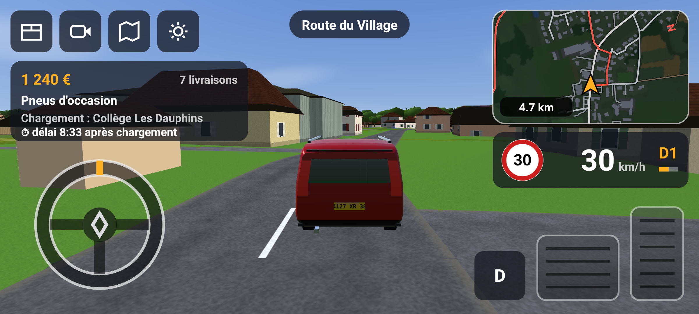

# Rochetoirin Simulator

Un jeu de conduite Android inspiré d'*Euro Truck Simulator*, dans le village de
**Rochetoirin (Isère, 38110)**, au volant d'un **Renault Espace IV rouge** (2002-2006).



Autres aperçus dans [`docs/apercus/`](docs/apercus/) : bocage et Alpes, village et église,
trottoirs et lanternes, rond-point, passage à niveau, entrée de Rochetoirin…

## Ce qui est fidèle à la réalité

| Élément | Source | Précision |
|---|---|---|
| Relief | IGN **RGE ALTI** (API altimétrie de la Géoplateforme) | grille de 10 m sur 4,6 × 6,2 km, 60 m pour l'horizon (17 km) |
| Routes | **OpenStreetMap** (Overpass) | tracé réel, largeur selon le type / nombre de voies, ponts, sens uniques |
| Limitations | OSM `maxspeed` sinon valeur par défaut française | 50 en agglomération, 80 hors agglo, 130 sur l'A43 |
| Noms de rues | OSM | affichés en haut de l'écran |
| Lieux de livraison | OSM (mairie, église Saint-Étienne, école, salle des fêtes, boulangerie, lieux-dits Pévrin, Vernavant, Falizan, L'Yris…) | |

Le terrain est « terrassé » sous les routes (comme dans ETS) pour qu'elles soient
roulables, puis raccordé en douceur au relief réel.

### Décor (données réelles)

| Élément | Source |
|---|---|
| ~4 400 bâtiments : emprise, hauteur, matériaux des murs et du toit, usage | IGN **BD TOPO** |
| Toits à quatre pans en tuiles (typiques du Bas-Dauphiné), bac acier pour les hangars, toits plats | généré d'après la BD TOPO |
| Façades : enduits variés, fenêtres et volets (couleurs aléatoires), soubassement | shader procédural |
| Église Saint-Étienne avec clocher et flèche | BD TOPO (nature « Église ») |
| Cultures de chaque parcelle (blé, orge, maïs, tournesol, colza, prairies…), vues en début d'été | IGN **RPG 2025** |
| Bois, forêts de feuillus, peupleraies, haies (polygones et linéaires), landes | BD TOPO végétation + haies |
| ~150 000 arbres et arbustes (chênes, résineux, peupliers, fruitiers, buissons), arbres de jardin et arbres isolés du bocage | générés dans ces zones |
| Étangs (Fricotière, Gole…), Bourbre, ruisseaux et canaux, avec reflets animés | BD TOPO hydrographie |
| Pylônes et lignes 63 kV avec câbles | BD TOPO |
| Horizon : Chartreuse, Belledonne, Vercors, Bugey, avec neige en altitude, courbure terrestre et brume de vallée | IGN RGE ALTI (±75 km) |
| Anneau lointain : forêts, eau et villes réelles, mosaïque de parcelles | BD TOPO |

### Équipements de la route

| Élément | Source |
|---|---|
| Stops (32) et cédez-le-passage (33) avec ligne au sol et panneau, côté de la circulation concernée | OSM (`highway=stop/give_way`) |
| Passages piétons en zébra (113), panneau C20a sur les routes principales | OSM (`highway=crossing`) |
| Feux tricolores (11) avec ligne d'arrêt | OSM (`highway=traffic_signals`) |
| Plateaux ralentisseurs et dos d'âne (12), surélevés avec dents de requin, panneau A2b 25 m avant — ressentis dans la physique | OSM (`traffic_calming`) |
| Voie ferrée Lyon – Grenoble : ballast, traverses, rails, caténaires ; passages à niveau avec croix de Saint-André, feux, demi-barrières, rails noyés dans l'enrobé, panneau A7 | OSM (`railway`) |
| Panneaux d'entrée / sortie d'agglomération (Rochetoirin…), limitations de vitesse | OSM (`traffic_sign`) |
| Trottoirs (bordure de 14 cm, largeur adaptée aux façades, interrompus aux carrefours) | OSM `sidewalk` sinon déduits des zones bâties |
| ~1 500 lampadaires : lanternes de style ancien au centre du village, crosses modernes ailleurs | OSM + déduits (tous les 38 m en zone bâtie) |
| Terre-pleins : îlots engazonnés des ronds-points, glissières sur l'A43, bordures entre chaussées séparées | OSM (`junction=roundabout`, chaussées à sens unique opposées) |

Les bâtiments, arbres, haies, poteaux, îlots et glissières sont **solides** : un choc arrête le
véhicule et coûte une petite facture de carrosserie. Les trottoirs et ralentisseurs se montent.

## Gameplay

* **Livraisons** façon ETS : carnet d'offres (marchandise, départ, arrivée, distance,
  rémunération), chargement sur place, GPS avec itinéraire calculé sur le vrai graphe
  routier, prime de ponctualité. L'argent est sauvegardé.
* **GPS** en haut à droite, zoom automatique selon la vitesse, carte complète en touchant le GPS.
* **Compteur**, rapport engagé (boîte auto 5 rapports), compte-tours, panneau de limitation
  (la vitesse passe en rouge en cas d'excès).
* **3 caméras** : poursuite, cabine (conduite à gauche, planche de bord centrale de l'Espace),
  poursuite éloignée. Glisser au centre de l'écran pour tourner la caméra / regarder autour.
* **Commandes** : volant tactile (ou inclinaison du téléphone, dans les options), pédales
  d'accélérateur / frein analogiques (appuyer plus haut = plus fort), sélecteur D / R,
  klaxon au centre du volant (sur le losange).
* **Son moteur synthétisé** (4 cylindres, admission, vent, roulement) et klaxon deux tons.
* **Physique** : couple d'un 2.0 16V ~140 ch, convertisseur, frein moteur, résistance de
  l'air, pente, adhérence moindre dans l'herbe et sur les chemins, sous-virage, tangage /
  roulis / pompage de la suspension.

## Le véhicule

Espace IV modélisé de façon procédurale (aucun fichier 3D) : pare-brise très incliné dans le
prolongement du capot, montants noirs donnant l'effet de vitrage continu, feux arrière
verticaux, barres de toit, rétroviseurs, jantes 5 branches, losange Renault, et les
**anciennes plaques FNI** : blanche à l'avant, **jaune à l'arrière**, numéro en **38**.

## Construire

Pré-requis : JDK 17+, Android SDK (platform 34, build-tools 34).

```bash
./gradlew assembleRelease   # APK : app/build/outputs/apk/release/app-release.apk
```

L'APK de release est signé avec la clé de debug pour pouvoir être installé directement
(`adb install` ou copie sur le téléphone). Android 7.0+ et OpenGL ES 3.0 requis.

## Régénérer les données

```bash
cd tools
pip install numpy scipy
./fetch_osm.sh             # routes, lieux, voie ferrée, mobilier OSM -> tools/data/osm*.json, pois.json
python3 fetch_elevation.py   # relief IGN -> tools/data/elev_*.npy
pip install shapely mapbox-earcut pillow
python3 fetch_decor.py       # BD TOPO + RPG (WFS Géoplateforme) -> tools/data/wfs_*.json
python3 prepare_data.py      # -> app/src/main/assets/{terrain.bin, far.bin, roads.bin, map.json}
python3 prepare_decor.py     # -> landcover.png, landfar.png, props.bin, trees.bin, collide.bin, pano.bin
python3 prepare_street.py    # -> street.bin, decals.bin, surf.bin, street.json (+ collide.bin complété)
```

Requêtes Overpass utilisées (bbox `45.552,5.383,45.618,5.445`) :
`way["highway"]` (avec nœuds) pour les routes, et `place` / `amenity` / `shop` / `leisure`…
(`out center tags`) pour les lieux.

## Organisation du code

```
app/src/main/java/fr/rochetoirin/sim/
  MainActivity.kt        plein écran, chargement, capteurs, sauvegarde
  world/World.kt         terrain, routes, graphe, ponts, requêtes spatiales
  car/CarModel.kt        modèle 3D procédural de l'Espace
  car/Vehicle.kt         physique du véhicule
  game/Game.kt           boucle de jeu, livraisons, limitations, noms de rues
  game/Gps.kt            itinéraire A* sur le graphe OSM
  render/Renderer.kt     OpenGL ES 3 (tranches de profondeur, tuiles, caméras)
  render/Shaders.kt      terrain herbeux, routes avec marquages au sol, ciel, carrosserie
  ui/HudView.kt          interface tactile, GPS, compteur, menus
  ui/MapPainter.kt       carte vectorielle
  audio/EngineSound.kt   synthèse sonore temps réel
tools/                   préparation des données (Python)
```

Données : © contributeurs OpenStreetMap (ODbL) ; IGN RGE ALTI, BD TOPO et RPG (Licence Ouverte Etalab).

## Tests

```bash
./gradlew testDebugUnitTest
```

* `SimulationTest` : chargement du monde réel, accélération / freinage, accessibilité des
  lieux, et une **livraison complète par pilote automatique** (mairie → chargement →
  livraison → paiement) sur le vrai réseau routier.
* `collisionWithHouse` : on fonce dans une maison du village, le véhicule s'arrête et le choc est facturé.
* `HudSnapshotTest` (Robolectric) : rendu de l'interface dans `app/build/hud/*.png`.
