# Rochetoirin Simulator — branche `godot` (refonte)

Refonte complète sous **Godot 4** : relief IGN à 2 m, routes OpenStreetMap posées sur le relief réel, textures PBR,
ciel HDRI, horizon réel (Alpes, courbure terrestre). Zone : Rochetoirin, La Tour-du-Pin, Saint-Clair-de-la-Tour,
Saint-Chef, L'Isle-d'Abeau et les routes qui y mènent.

## Télécharger

**[RochetoirinSimulator-v4.5.apk — Android](https://github.com/DisColow/rochetoirin-drive/raw/godot/releases/RochetoirinSimulator-v4.5.apk)**
(construit automatiquement par GitHub Actions ; Android 8+, OpenGL ES 3).

**Windows et Steam Deck** : [Actions > Windows et Steam Deck](https://github.com/DisColow/rochetoirin-drive/actions/workflows/desktop.yml),
ouvrir la dernière exécution réussie, puis télécharger en bas de page (compte GitHub connecté) :
- `RochetoirinSimulator-vX.Y-windows` : dézipper, lancer `RochetoirinSimulator.exe` (clavier : flèches, C caméra,
  M carte, R replacer ; manette ; la souris fait office de doigt sur les boutons) ;
- `RochetoirinSimulator-vX.Y-steamdeck` : en mode Bureau, extraire l'archive, Steam > Jeux > Ajouter un jeu non Steam
  > `RochetoirinSimulator.x86_64`, puis jouer en mode Jeu (voir `LISEZMOI.txt`).
Les archives restent 90 jours ; chaque nouvelle version en produit de nouvelles.

Nouveautés de la v4.5 :
- **versions Windows et Steam Deck** construites automatiquement par GitHub Actions à chaque nouvelle version
  (textures compressées pour PC, fenêtre agrandie, souris utilisable comme le doigt sur les boutons).

[v4.4 — vrais animaux dans les prés](https://github.com/DisColow/rochetoirin-drive/raw/godot/releases/RochetoirinSimulator-v4.4.apk)

Nouveautés de la v4.4 :
- **animaux des prés** : les modèles faits main sont remplacés par de jolis modèles gratuits et texturés (Sketchfab,
  CC BY 4.0, crédités dans ⚙ > Crédits) : **vaches Montbéliardes** pie rouge, **moutons** laineux, **chevaux** (bais,
  alezans ou gris selon l'animal) ; ils broutent toujours (tête qui monte et descend, queue qui bat).

[v4.3 — bâtiments revus avec vous](https://github.com/DisColow/rochetoirin-drive/raw/godot/releases/RochetoirinSimulator-v4.3.apk)

Nouveautés de la v4.3 (suite de la revue des modèles) :
- **fenêtres** : les étages sous un toit bas reçoivent des fenêtres plus basses au lieu de rien, et les pignons hauts une
  fenêtre de comble (avec volets sur les maisons anciennes) ;
- **plus de socle noir** sous les maisons : soubassement dans l'enduit du mur, 25 cm, et ombre du pied des murs adoucie ;
- **commerces** : toit-terrasse (sauf bâtiments anciens), fenêtres sans volets, et **devanture avec grande enseigne**
  sur les 512 bâtiments commerciaux qui n'en avaient pas (métier tiré au sort, nom inventé : jamais de vraie marque) ;
- **immeubles** : **escaliers extérieurs** avec garde-corps jusqu'aux portes des étages (529 immeubles), côté rue
  de préférence.

[v4.2 — relief lisse, parkings, vrais champs de blé](https://github.com/DisColow/rochetoirin-drive/raw/godot/releases/RochetoirinSimulator-v4.2.apk)

Nouveautés de la v4.2 :
- **relief lisse** : fini les plateaux en escalier sur les pentes ; le relief vient désormais du LiDAR HD de l'IGN
  (1 m, moyenné à 2 m) au lieu d'une grille de 5 m agrandie en marches ;
- **parkings** : 515 parkings en enrobé, nivelés, avec **13 800 places marquées** (le long des allées, ou en rangées
  quand aucune allée n'est cartographiée) et des voitures garées sur un tiers d'entre elles ;
- **champs de blé** : une vraie nappe d'épis dorés qui suit le relief et s'arrête net au bord du champ, bordée d'épis
  vus de côté, au lieu de rangées de « murs » sombres en dents de scie ;
- **clôtures des prés** : les fils barbelés sont enfin visibles (ils étaient mal orientés) et les piquets sont fins ;
- **sorties d'autoroute** : les glissières de l'autoroute et de la bretelle partent de l'absorbeur et forment le
  triangle du musoir ;
- **haies** sans les bosses (touffes) ; **plus de taches sombres** dans l'herbe des bas-côtés ;
- **vue cockpit** : la caméra ne s'oriente plus au doigt (on ne sort plus du tableau de bord).

[v4.1 — retour de la voiture en 3D](https://github.com/DisColow/rochetoirin-drive/raw/godot/releases/RochetoirinSimulator-v4.1.apk)

Nouveautés de la v4.1 :
- **la voiture est de nouveau affichée avec son modèle 3D** par défaut ; le sprite pixel art reste au choix dans ⚙.

[v4.0 — plus rien ne surgit ni ne disparaît d'un coup](https://github.com/DisColow/rochetoirin-drive/raw/godot/releases/RochetoirinSimulator-v4.0.apk)

Nouveautés de la v4.0 :
- **fin des apparitions et disparitions brutales** : les objets (glissières, panneaux, péages, commerces, voitures
  garées, animaux, équipements sportifs, poteaux) ne sont plus affichés par tuiles entières de 256 m mais par cases
  de 64 m, et **s'effacent en fondu tramé** à l'approche de leur portée au lieu de surgir d'un bloc ; même chose pour
  les panneaux et marquages des routes, les clôtures, les touffes de haie, les détails des maisons et les cultures ;
- **arbres** : le relais entre arbre 3D et imposteur (image plate au loin) se fait depuis la caméra, en fondu tramé,
  et se rapproche quand le nombre d'arbres 3D est plafonné : plus de trous ni d'arbres qui clignotent ;
- **péages** : les vitres des cabines dépassaient dans les voies en panneaux sombres flottants (on aurait dit des
  obstacles) ; elles sont maintenant à fleur des cabines ;
- marge anti-clignotement rétablie partout (le fondu de visibilité de Godot ne marche pas en rendu Compatibility et
  supprimait cette marge).

[v3.9 — vrais péages, panneaux de destinations, nouveau sprite de la voiture, pluie enregistrée](https://github.com/DisColow/rochetoirin-drive/raw/godot/releases/RochetoirinSimulator-v3.9.apk)

Nouveautés de la v3.9 :
- **péages fonctionnels** (Bourgoin, L'Isle-d'Abeau Centre, La Tour-du-Pin, entrées et sorties) : la bretelle s'élargit
  en 2 ou 3 voies séparées par de longs îlots à nez rayés jaune et noir, cabines, grand auvent blanc à bandeau bleu
  « PÉAGE » éclairé la nuit, signaux de voie (flèche verte, télépéage « t », CB, ticket), présignalisation « PÉAGE »
  et limitation à 30 ; **une barrière par voie qui se lève quand on arrive** (jamais d'arrêt obligatoire), ticket
  pris à l'entrée, paiement à la sortie selon la distance parcourue, avec message et bip ; le trou dans la route
  sous l'auvent de La Tour-du-Pin est comblé ;
- **panneaux de destinations** sur l'autoroute : confirmation après chaque entrée (« A 43 — Chambéry 41 km,
  Genève 106 km »…) selon le sens de circulation ;
- **nouveau sprite de la voiture** d'après la planche fournie (détourée, rangée par angle de vue et hauteur) ;
- **caméra qui ne traverse plus les murs, les haies ni le relief** (bras à ressort) et sprite qui ne s'enfonce plus
  dans la route ;
- **pluie et orage enregistrés** (Premankur Adhikary, Pixabay) au lieu du son de synthèse ; **page Crédits** dans ⚙.

[v3.8 — voiture en sprite, haies feuillues, maisons détaillées](https://github.com/DisColow/rochetoirin-drive/raw/godot/releases/RochetoirinSimulator-v3.8.apk)

Nouveautés de la v3.8 :
- **la voiture devient un sprite pixel art** façon jeux de course des années 90 : l'Espace est précalculé dans
  Blender sous 384 vues (32 angles × 4 hauteurs × braquage gauche / droit / droite), réduit en pixel art (palette de
  40 couleurs, contour sombre, reflets), et la bonne vue s'affiche selon la position de la caméra ; la caisse s'incline
  avec le roulis, les feux arrière s'allument la nuit et au freinage, l'ombre reste celle de la vraie voiture 3D.
  Réglage ⚙ « Voiture : Sprite pixel art / Modèle 3D » pour revenir à la voiture 3D ; vues conducteur et capot
  inchangées ;
- **haies** : touffes de feuillage modélisées dans Blender (thuya en rameaux, laurier-palme vernissé, photinia aux
  pousses rouges, haie champêtre aux feuilles variées), posées par milliers sur le dessus et les flancs des haies,
  qui ondulent au vent : fini les blocs verts lisses ;
- **maisons** : kit de détails modélisé dans Blender posé sur toutes les maisons (≈ 830 000 pièces, affichées près de
  la caméra) : fenêtres à deux vantaux et petits-bois, volets battants à barres et écharpe de la couleur de la
  maison, volets roulants avec coffre, portes d'entrée moulurées avec seuil, marquises vitrées, portes de garage
  sectionnelles, tuiles faîtières sur les faîtages et les arêtiers, mitrons de cheminée, antennes râteau, paraboles ;
  vitres éclairées la nuit comme les façades.

[v3.7 — autoroutes refaites de fond en comble](https://github.com/DisColow/rochetoirin-drive/raw/godot/releases/RochetoirinSimulator-v3.7.apk)

Nouveautés de la v3.7 — **refonte des autoroutes** (A43, A48 et leurs échangeurs), façon Euro Truck Simulator :
- **tracé lissé** de bout en bout : plus d'angles ni de cassures, virages de plusieurs centaines de mètres de rayon ;
- **profil en long d'autoroute** : pentes ≤ 5 % (il y avait des pentes à 20 % et des bosses en montagnes russes),
  raccordements verticaux de plusieurs kilomètres, déblais et remblais avec de vrais talus, les deux chaussées à la
  même hauteur ; **gabarit de 5 m sous tous les ponts** (certains tabliers étaient à 1,5 m de la chaussée) ;
- **terre-plein central** : les deux chaussées ne se chevauchent plus (c'était le cas une fois sur deux) ;
  séparateur en béton (GBA) quand il est étroit, double glissière sinon ;
- **profil en travers français** : bande dérasée de 1 m, voies de 3,5 m, bande d'arrêt d'urgence de 3 m, largeur qui
  varie en biseau quand le nombre de voies change ; enrobé d'autoroute plus sombre et plus uniforme ;
- **bretelles** : voie de décélération (biseau + voie parallèle) et voie d'accélération (200 m) accolées à droite,
  au lieu de bretelles qui coupaient les voies en diagonale ; profils sans rupture (pentes ≤ 8 %), bifurcations
  A48 / A43 propres ;
- **marquages réglementaires** : rive gauche continue, séparation des voies en tirets de 3 m tous les 13 m, rive de
  la bande d'arrêt d'urgence en traits de 39 m, ligne épaisse des voies d'entrée et de sortie, **zébras aux musoirs** ;
- **équipements** : glissières à l'échelle réelle (poteaux fins, catadioptres) qui suivent les vrais bords (voies
  auxiliaires, bretelles), **potences de sortie** au-dessus des voies, panneaux « SORTIE » et **absorbeurs de choc**
  aux musoirs, limitations de vitesse, **clôture grillagée d'emprise** ; panneaux et bornes d'appel d'urgence enfin
  **du bon côté** (ils étaient dans le terre-plein central) ; arbres et cultures écartés de l'emprise.

[v3.6 — panneaux de sortie complets, plaques d'égout](https://github.com/DisColow/rochetoirin-drive/raw/godot/releases/RochetoirinSimulator-v3.6.apk)

Nouveautés de la v3.6 :
- présignalisation de **toutes les sorties d'autoroute** (1 000 m et 500 m, 44 panneaux), cartouche « SORTIE n »
  lisible ;
- **plaques d'égout** en fonte dans l'enrobé des rues ;
- essai automatique du gardien (`--void-test`) : il ne tire que lorsque la voiture tombe dans le vide hors de la carte.

[v3.5 — commerces, stades, animaux, autoroutes, nouveau cockpit, kaméhaméha](https://github.com/DisColow/rochetoirin-drive/raw/godot/releases/RochetoirinSimulator-v3.5.apk)

Nouveautés de la v3.5 :
- **commerces** (modèles faits avec Blender) : 233 devantures sur la vraie façade des commerces OSM (vitrines,
  porte vitrée, enseigne avec lampes col-de-cygne, stores rayés, croix de pharmacie, carotte de tabac, terrasses de
  café), 14 supermarchés (grande enseigne, auvent d'entrée, totem, abri à chariots) et des stations-service ;
  **toutes les marques sont parodiées** (Carrefou, Entremarché, Lidol, E.Leplerc, La Pausse, Crédit Agricolo,
  McDonuts, Totale…) et les commerces indépendants ont des noms inventés ; enseignes et vitrines éclairées la nuit ;
- **terrains de sport** : foot, rugby, tennis (terre battue ou résine, grillage), basket, multisport, pétanque, avec
  leurs tracés, buts et filets, paniers, mâts d'éclairage et bancs de touche ;
- **animaux dans les prés** : vaches (Montbéliardes, Charolaises), moutons, chevaux, qui broutent et chassent les
  mouches de la queue, dans les prairies où c'est logique ; **prés clos** de piquets et de barbelés ;
- **champs de blé refaits** : vrais épis en rangs serrés, plus de nappes qui flottaient (les « bugs graphiques ») ;
- **vue cockpit** : pixel art retravaillé (similicuir grainé, haut-parleurs, baguettes alu, interrupteurs, feux de
  détresse, reflets sur le verre des compteurs, bande teintée en haut du pare-brise, ciel de toit perforé, volant en
  cuir surpiqué) ; **plus de bras** : le volant tourne tout seul ;
- **caméra au doigt** : glisser sur l'écran (hors boutons) pour regarder autour ; elle revient en place toute seule ;
- **autoroutes** : glissières de sécurité le long des chaussées et du terre-plein central (ouvertes aux bretelles),
  bornes d'appel d'urgence orange à leurs vraies places, panneaux bleus de présignalisation des sorties (numéro,
  destinations, 1 000 m / 500 m), balises à chevrons au nez des bretelles, gares de péage (auvent et cabines hors des
  voies) ;
- **gardien** : il dit « Ka… mé… ha… mé… » en chargeant (mains jointes à la hanche, boule bleue) et ne tire,
  « HAAA ! » bras tendus, que si l'on tombe vraiment dans le vide hors de la carte ; rayon plus épais et animé,
  secousse à l'impact.

**[RochetoirinSimulator-v3.4.apk — correctif : plantage au démarrage depuis la v3.1](https://github.com/DisColow/rochetoirin-drive/raw/godot/releases/RochetoirinSimulator-v3.4.apk)**
(construit automatiquement par GitHub Actions ; Android 8+, OpenGL ES 3).

Nouveautés de la v3.4 :
- **correctif du plantage juste après l'écran de démarrage** (v3.1 à v3.3) : l'ambiance des matériaux (vent, ombres
  des nuages, pluie) n'utilise plus de paramètres globaux de shader, refusés par certains GPU de téléphone ;
- **mode sûr** : si un démarrage plante quand même, le suivant se lance sans le shader modifié du relief.

**[RochetoirinSimulator-v3.3.apk — voitures dans les cours, tracteurs, horizon plus garni](https://github.com/DisColow/rochetoirin-drive/raw/godot/releases/RochetoirinSimulator-v3.3.apk)**
(APK d'environ 660 Mo, Android 8+, OpenGL ES 3).
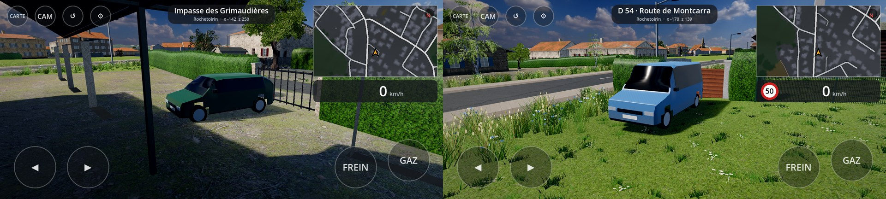

Nouveautés de la v3.3 (la vie des villages) :
- **1 400 voitures garées dans les cours**, derrière les portails, capot vers la maison (citadines, compactes,
  breaks, ludospaces des années 80 à 2000, couleurs variées, un peu de poussière en bas de caisse) ; jamais sur la
  route, dans un bâtiment ou à travers une clôture ; on ne passe pas au travers ;
- **poubelles** (verte et grise) à côté des portails, **tracteurs** près des bâtiments agricoles ;
- **arbres visibles plus loin** (jusqu'à 1,6 km en Élevée, 2,2 km en Maximale) : l'horizon ne se vide plus ;
- **l'Espace brille sous la pluie** (carrosserie mouillée).

[v3.2 — météo : pluie, route mouillée, brouillard, ciel couvert](https://github.com/DisColow/rochetoirin-drive/raw/godot/releases/RochetoirinSimulator-v3.2.apk)
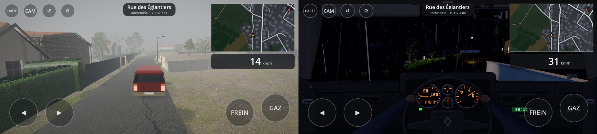

Nouveautés de la v3.2 (réglage **Météo** dans ⚙, combinable avec l'heure de la journée) :
- **beau temps** (comme avant), **couvert** (ciel gris, soleil voilé, ombres pâles, couleurs plus douces),
  **pluie**, **brouillard** (on ne voit plus qu'à 100-200 m, le ciel se fond dans la brume) ;
- **pluie** : traits de pluie poussés par le vent et par la vitesse, bruit de pluie sur la tôle, ciel sombre ;
  - la route se mouille peu à peu : enrobé sombre et brillant qui reflète le ciel et les phares, **flaques** avec des
    ronds de gouttes, trottoirs, murs, toits et terre assombris ; elle sèche quand la pluie s'arrête ;
  - en vue cockpit : **gouttes sur le pare-brise** (elles remontent quand on roule vite) et **essuie-glaces** qui
    balaient ;
  - gerbes d'eau derrière les roues à la place de la poussière ;
- phares allumés automatiquement sous la pluie et dans le brouillard ; pas d'oiseaux sous la pluie.

[v3.1 — vent, nuages qui passent, oiseaux, poussière](https://github.com/DisColow/rochetoirin-drive/raw/godot/releases/RochetoirinSimulator-v3.1.apk)
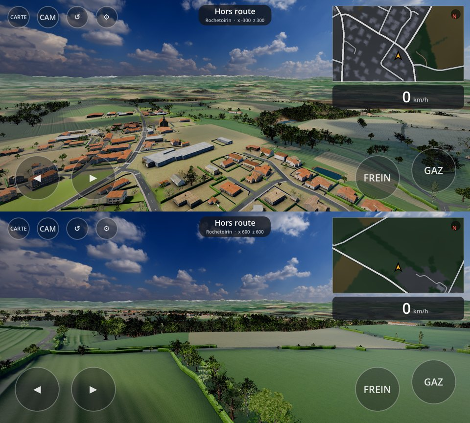

Nouveautés de la v3.1 (le paysage bouge) :
- **vent** : les arbres ploient dans les rafales et leur feuillage frémit (vrais modèles et arbres lointains), les
  cultures se couchent et des vagues plus claires traversent les champs de blé, l'herbe et les fleurs suivent les
  mêmes rafales ;
- **ombres des nuages** qui glissent sur le relief, les champs, les villages et les routes (à midi et en fin
  d'après-midi) ;
- **vols d'oiseaux** de temps en temps devant la voiture (battements d'ailes et vol plané), le jour ;
- **poussière** derrière les roues arrière dès qu'on roule hors du bitume (chemins, champs, bas-côtés).

[v3.0 — vue cockpit en pixel art, image plus nette](https://github.com/DisColow/rochetoirin-drive/raw/godot/releases/RochetoirinSimulator-v3.0.apk)
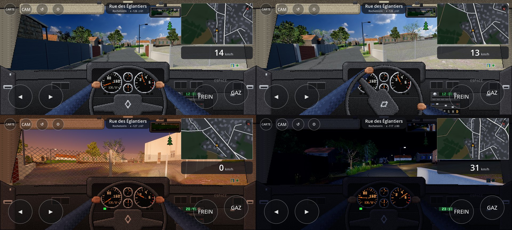

Nouveautés de la v3.0 :
- **vue cockpit refaite en pixel art**, à la manière des vieux jeux de voitures : habitacle de l'Espace I dessiné en
  gros pixels (pavillon, pare-soleil, montants, planche de bord, aérateurs, autoradio K7, commandes de chauffage,
  boîte à gants, vignette auto sur le pare-brise) par-dessus la route en 3D ;
  - compteurs à aiguilles orange (vitesse, compte-tours d'une boîte auto à 4 rapports, essence, température) ;
  - volant deux branches au losange Renault qui tourne avec la direction, mains du conducteur dessus ;
  - heure sur l'autoradio, voyant vert des phares, lettre de la boîte (P, R, D) allumée ;
  - rétroviseur avec une vraie vue arrière en basse résolution, sapin désodorisant qui se balance dans les virages ;
  - l'habitacle suit les secousses, prend la lumière de l'heure choisie, compteurs rétroéclairés la nuit ;
- **image plus nette** : filtrage anisotrope 16×, anticrénelage 4× aux réglages Élevée et Maximale (fils, clôtures et
  toits sans escaliers) ;
- **ombre de contact sous l'Espace** (la voiture ne « flotte » plus quand le soleil est haut).

[v2.9 — gardien des limites, lignes électriques, lampadaires, étalonnage](https://github.com/DisColow/rochetoirin-drive/raw/godot/releases/RochetoirinSimulator-v2.9.apk)
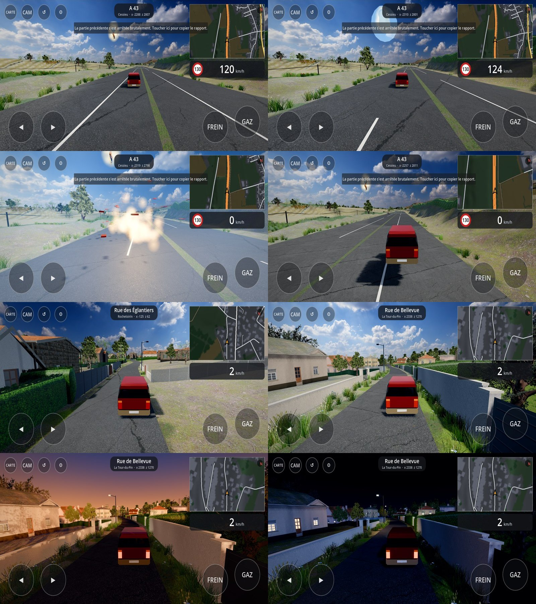

Nouveautés de la v2.9 :
- **gardien des limites** : un combattant volant plane au-delà de la limite de la carte (modèle « Goku (Rigged &
  Animated) » de Kari, CC BY 4.0) ; quand on s'approche du bord, on l'entend charger son attaque et la boule d'énergie
  grossit ; si on sort, il tire sa vague d'énergie : l'Espace explose (flammes, fumée, débris) puis réapparaît sur la
  route la plus proche, dans le sens inverse ; pas de cinématique, le jeu continue ;
- **lignes électriques** : pylônes haute tension et poteaux bois ou béton à leur vraie place (OSM), fils qui pendent ;
- **lampadaires** dans les villages (allumés le soir, avec de vraies lumières près de la voiture) ;
- **étalonnage de l'image** : couleurs plus riches, netteté, vignette (désactivé au réglage de végétation Faible).

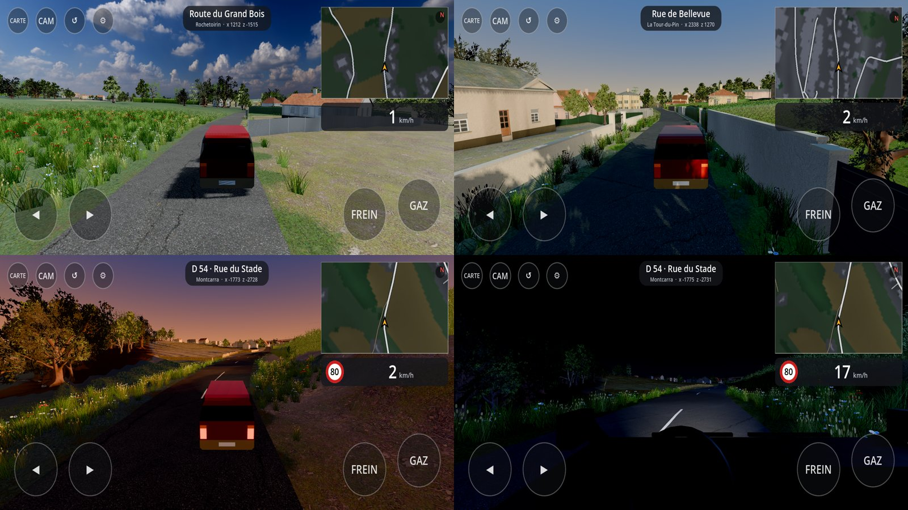

Nouveautés de la v2.8 (« rendre le jeu beaucoup plus joli », points 1 à 4) :
- **herbe et fleurs en 3D autour de la voiture** : pelouse rase dans les villages, herbe haute, coquelicots, boutons
  d'or et bleuets dans les prés, graminées et fleurs sur les bas-côtés, fougères en sous-bois ; elles ondulent au vent
  et s'effacent en douceur au loin ; rien ne pousse sur les routes, trottoirs, bâtiments, clôtures, eau ou champs
  (carte du sol au mètre) ; densité selon le réglage de la végétation ;
- **ombres douces** : pied des murs assombri, sol plus sombre au pied des maisons et sous les arbres ;
- **maisons patinées** : gouttières et descentes d'eau, coulures sous les fenêtres, tuiles inégales, mousse sur les
  pans orientés au nord ;
- **heure de la journée** (bouton ⚙) : midi, fin d'après-midi dorée, coucher de soleil, nuit au clair de lune avec les
  phares de l'Espace et des fenêtres éclairées ; image un peu plus contrastée.

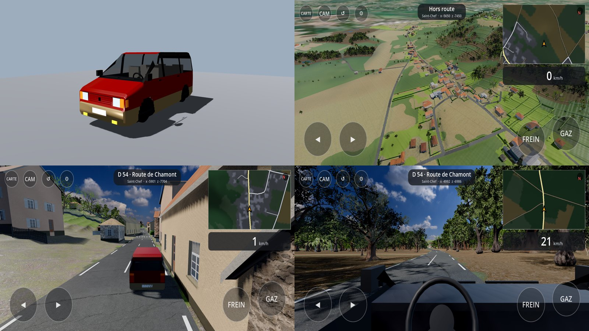

Nouveautés de la v2.7 :
- **la voiture est un Renault Espace I** (1984-1988), comme celui du père de l'utilisateur : rouge foncé, tout le bas
  beige doré, calandre rouge à lamelles, phares carrés et clignotants orange, antibrouillards jaunes, jantes tôle à
  enjoliveurs argentés, grand pare-brise très incliné ; 7 places à l'intérieur (modèle fait sur mesure d'après une
  photo et les cotes réelles) ;
- **Chamont** : la carte s'agrandit au nord de Saint-Chef (7 km² de plus) : le hameau et la D 54 (route de Chamont),
  avec relief, maisons, arbres, champs, clôtures ; Chamont figure dans la liste des communes de la carte ;
- **marche arrière comme dans les jeux** : en reculant, GAZ freine puis repart en avant (plus besoin de s'arrêter
  complètement) ; FREIN en avançant freine puis recule ;
- **collisions des maisons** : on ne traverse plus les murs (collisions des deux côtés, et tous les bâtiments en ont).

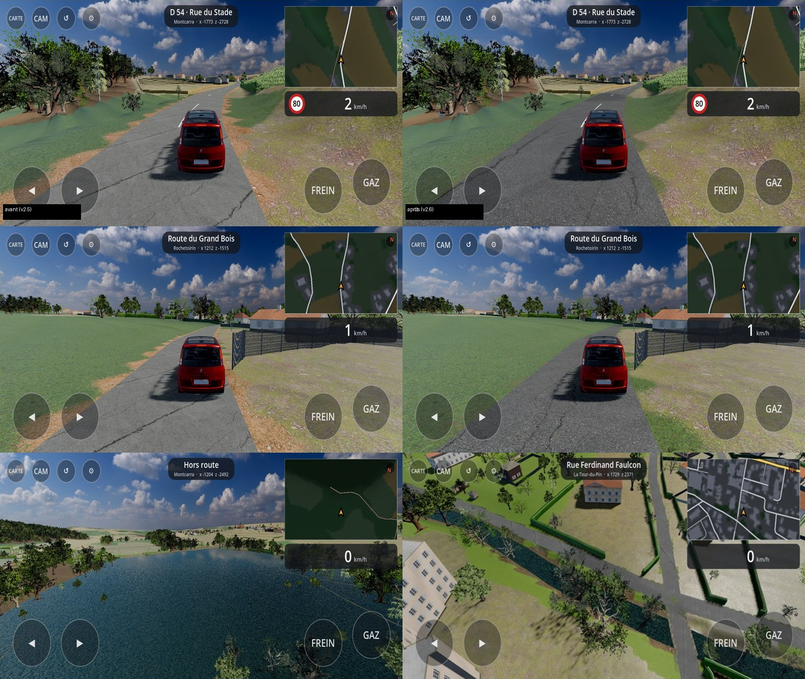

Nouveautés de la v2.6 (étape 6 : textures et finitions) :
- **rivières, ruisseaux et étangs** (BD TOPO) : la Bourbre, le Bion, les ruisseaux permanents, 166 étangs, retenues
  et mares ; surface qui reflète le ciel, vaguelettes qui suivent le courant ; l'eau ne remonte jamais la pente, le
  terrain est creusé dessous (fond vaseux), et elle s'arrête au bord des routes (sauf sous les ponts) ;
- **bas-côtés** : fini les bandes de terre orange le long de toutes les routes ; herbe rase un peu usée, plus étroite ;
- **enrobé** plus sombre et moins répétitif (deux échelles mélangées, reprises et usure en grandes plaques) ;
- **prés moins uniformes** : variations de teinte à grande échelle ;
- haies plus claires (elles paraissaient noires de loin).

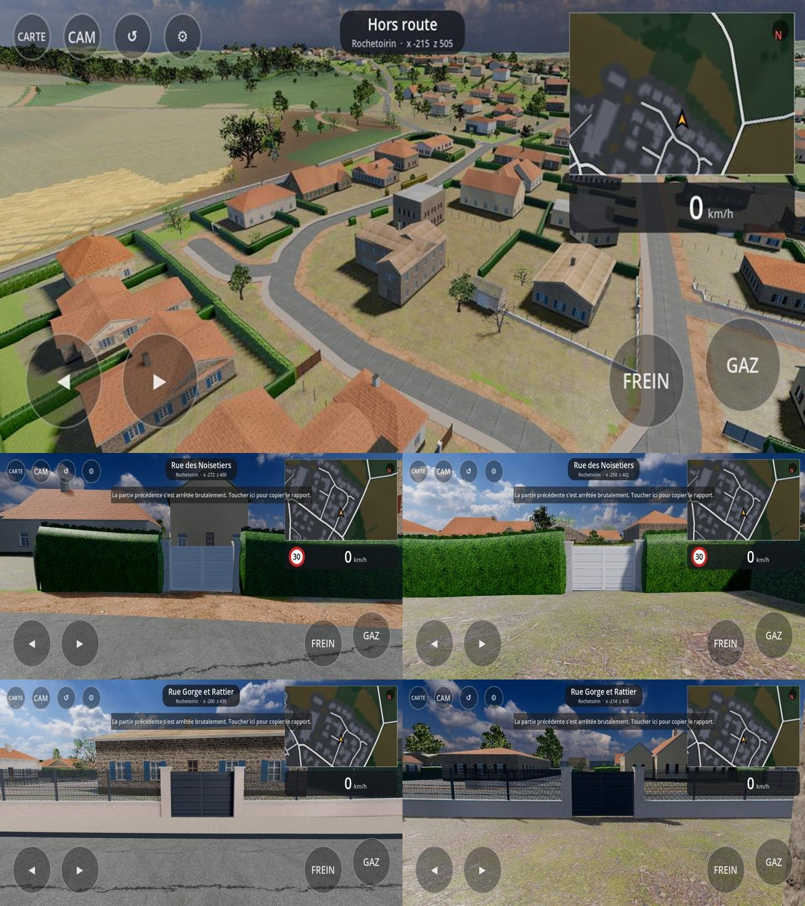

Nouveautés de la v2.5 (étape ajoutée : ce qui délimite les propriétés) :
- **8 700 propriétés clôturées** d'après le cadastre (IGN Parcellaire Express) : 670 km de haies (thuyas, lauriers,
  photinias), grillages rigides et à mailles losanges, murets avec grille ou panneaux, murs, panneaux occultants,
  lisses, clôtures en bois ;
- **2 300 portails** entre deux piliers (fer, barreaux, pleins, bois), face à la maison et toujours devant un passage
  libre ; pas de portail là où une allée entre déjà dans la propriété ;
- **Rochetoirin d'après Street View** : les 171 façades relevées à la main (type de clôture, couleur du mur, de la
  grille, du portail) ; ailleurs, haies et murs OSM / BD TOPO, sinon la même répartition que dans le bourg ;
- **haies du bocage** le long des champs (BD TOPO, OSM), à la hauteur mesurée par le LiDAR ;
- un seul style par limite, d'un bout à l'autre ; pas de clôture dans un bâtiment ; **rien sur la route** : les
  limites côté rue sont reculées hors de la chaussée et du trottoir (contrôle automatique : 0 point sur 210 000) ;
- maillages construits en jeu dans un fil de calcul (18 Mo de données au lieu de 900 Mo), sans à-coup.

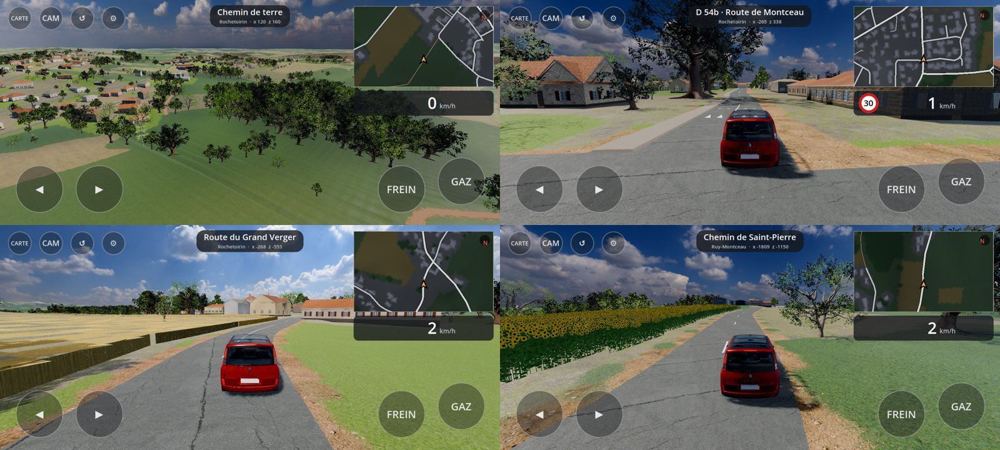

Nouveautés de l'étape 5 :
- **245 000 arbres réels**, à leur place et à leur hauteur (LiDAR HD de l'IGN, jusqu'à 32 m) : chênes, feuillus,
  bouleaux, peupliers, épicéas, pins (modèles 3D Sketchfab) ; vrais modèles près de la voiture (ombres, troncs avec
  collision), imposteurs à 8 vues au loin ;
- **champs en 3D** d'après le Registre parcellaire 2024 : maïs, blé et autres céréales, colza / soja, tournesol ;
- **densité de végétation réglable** (bouton ⚙ : Faible, Moyenne, Élevée, Maximale) ;
- **rien ne déborde sur la route** : arbres, champs et bâtiments s'arrêtent au bord de la chaussée.

Retours de la v2.3 :
- **carte et GPS de la première version** : mini-GPS en haut à droite (tourne avec la voiture, zoom selon la vitesse),
  fond sombre d'occupation du sol et relief, routes nettes à tous les zooms, bâtiments ; nom de la rue dans une
  pastille en haut au centre ; panneau de limitation de vitesse à côté du compteur ;
- **téléportation réparée** (la voiture était replacée à son point de départ) ;
- **vue cockpit réparée** : habitacle complet (toit, montants), volant qui tourne avec la direction ;
- **sol plus propre** : plus de petites taches de terre ou de roche ; la texture dominante de chaque zone l'emporte,
  les champs cultivés réels sont en terre ;
- rendu allégé (carte : un millier d'appels de dessin en moins par image).

Nouveautés de l'étape 4 (d'après des photos de référence de chaque monument) :
- **églises** de Rochetoirin, La Tour-du-Pin, Saint-Clair, Saint-Jean-de-Soudain, Cessieu, Montcarra, L'Isle-d'Abeau
  et **abbatiale de Saint-Chef** : nef, bas-côtés, abside, clocher à sa place réelle (façade, chevet ou côté), flèche
  de pierre ou d'ardoise, pinacles, abat-son, horloge, portail, rosace, vitraux en plein cintre ou en ogive, croix ;
- **chapelles** à clocheton, **tour du Pollet** en ruine, **châteaux** du Marchil (tours rondes) et de Thézieux ;
- **mairies** aux couleurs réelles, plaque « MAIRIE », drapeaux français et européen (mâts à Montcarra) ;
- 10 **monuments aux morts** et 13 **croix de chemin**.

Physique et confort (retours de la v2.2.1) :
- moteur physique Jolt (plus robuste) ; plus de basculement sur le côté (centre de gravité bas, anti-roulis) ;
- vitesse : 130 km/h en 10 s, pointe vers 180 km/h ;
- voiture retournée ou sur le flanc : remise automatique sur la **route la plus proche**, dans le bon sens ;
- rapport de plantage plus fiable (aussi en cas de blocage, état noté au décollage des sauts).

Nouveautés de l'étape 3 :
- **18 000 bâtiments** aux emprises et hauteurs réelles (IGN BD TOPO) : maisons, annexes, immeubles, commerces,
  bâtiments d'activité ; toits à 2 ou 4 pans (y compris en L / T), hauteur de faîtage réelle quand elle est connue,
  toits-terrasses avec acrotère ; tuiles, ardoise ou bac acier selon la couleur du toit sur la photo aérienne ;
  murs en crépi (teintes du Dauphiné), pierre, brique, bardage bois ou métal ; fenêtres en retrait avec appuis,
  volets battants ou roulants, porte côté rue, portes de garage, vitrines, cheminées ; pas de fenêtre sur les murs
  mitoyens ; collisions ;
- **ralentisseurs** réels d'OpenStreetMap : 43 dos d'âne, 92 plateaux, 24 ralentisseurs courts, 22 coussins
  berlinois, avec relief (la voiture est secouée) et triangles blancs sur les rampes ;
- **nom de la route** sous le compteur (numéro et nom), avec la commune et les coordonnées x / z : pratique pour
  signaler un défaut à un endroit précis ;
- correctif : la téléportation depuis la carte fonctionne maintenant sur téléphone (fichier oublié dans la v2.1).

Correctifs de la v2.2.1 :
- plus de grandes plaques vertes sur la route (route de Montcarra et tous les vallons encaissés) : l'horizon simplifié
  n'est plus dessiné à l'intérieur de la zone jouable ;
- ombres : pleine qualité sur téléphone (4096 px, adoucies), portée 320 m avec fondu, plus de scintillement des
  façades ;
- rapport de plantage : si le jeu s'arrête brutalement, un bandeau au démarrage suivant permet de copier le rapport
  (position, route, images/s, mémoire) pour le coller dans un message.

Commandes : ◀ ▶ pour tourner, GAZ, FREIN (rester appuyé à l'arrêt pour reculer), CAM (poursuite / conducteur / capot),
↺ remet la voiture sur la route. Manette : stick gauche, gâchettes, Y caméra, X remettre sur la route.

## Crédits

Relief et orthophotos : IGN (Licence Ouverte). Routes : © contributeurs OpenStreetMap (ODbL). Textures et ciel :
Poly Haven et ambientCG (CC0). Voiture : « 2008 Renault Espace » par tonielpro520 (Sketchfab, CC-BY-4.0).
Terrain : Terrain3D (MIT). Bâtiments : IGN BD TOPO (Licence Ouverte), textures Poly Haven / ambientCG (CC0). Végétation : IGN LiDAR HD, BD TOPO, RPG (Licence Ouverte) ; arbres et maïs (Sketchfab, CC-BY-4.0) : « Oak tree » par massive-graphisme, « Realistic Tree » par danielpetrov, « Oak tree », « Birch tree » et « Pine Tree » par evolveduk, « Poplar tree » par evseevdaniil0011, « Spruce tree » et « Fir tree » par intice184, « Maize Corn Plant » par gilles.schaeck.

---

# Rochetoirin Simulator

Un jeu de conduite Android inspiré d'*Euro Truck Simulator*, dans le village de
**Rochetoirin (Isère, 38110)**, au volant d'un **Renault Espace IV rouge** (2002-2006).

## Télécharger

**[RochetoirinSimulator-v0.14.apk](https://github.com/DisColow/rochetoirin-drive/raw/main/releases/RochetoirinSimulator-v0.14.apk)** (36 Mo, Android 7.0+, OpenGL ES 3.0)

Ouvrir le lien depuis le téléphone, puis ouvrir le fichier et autoriser l'installation depuis
cette source (« Installer quand même » si Play Protect avertit : l'APK est signé avec une clé
de debug, il n'est pas publié sur le Play Store).

## Ce qui est fidèle à la réalité

| Élément | Source | Précision |
|---|---|---|
| Relief | IGN **RGE ALTI** (API altimétrie de la Géoplateforme) | grille de 10 m sur 4,6 × 6,2 km, 60 m pour l'horizon (17 km) |
| Routes | **OpenStreetMap** (Overpass) | tracé réel, largeur selon le type / nombre de voies, ponts, sens uniques |
| Limitations | OSM `maxspeed` sinon valeur par défaut française | 50 en agglomération, 80 hors agglo, 130 sur l'A43 |
| Noms de rues | OSM | affichés en haut de l'écran |
| Lieux de livraison | OSM (mairie, église Saint-Étienne, école, salle des fêtes, boulangerie, lieux-dits Pévrin, Vernavant, Falizan, L'Yris…) | |

Les chaussées séparées rapprochées (route de Lyon, D16, boulevards de La Tour-du-Pin…) sont
simplifiées en une seule route à double sens (sauf l'autoroute), et les raccords entre tronçons sont
mis à la même hauteur : plus de routes « coupées », ni de terre-plein ou de trottoir au milieu.

Le terrain est « terrassé » sous les routes (comme dans ETS) pour qu'elles soient
roulables, puis raccordé en douceur au relief réel.

### Décor (données réelles)

| Élément | Source |
|---|---|
| ~4 400 bâtiments : emprise, hauteur, matériaux des murs et du toit, usage | IGN **BD TOPO** |
| Toits à quatre pans en tuiles (typiques du Bas-Dauphiné), bac acier pour les hangars, toits plats | généré d'après la BD TOPO |
| Façades : enduits variés, fenêtres et volets (couleurs aléatoires), soubassement | shader procédural |
| Église Saint-Étienne avec clocher et flèche | BD TOPO (nature « Église ») |
| Cultures de chaque parcelle (blé, orge, maïs, tournesol, colza, prairies…), vues en début d'été | IGN **RPG 2025** |
| Bois, forêts de feuillus, peupleraies, haies (polygones et linéaires), landes | BD TOPO végétation + haies |
| ~150 000 arbres et arbustes (chênes, résineux, peupliers, fruitiers, buissons), arbres de jardin et arbres isolés du bocage | générés dans ces zones |
| Étangs (Fricotière, Gole…), Bourbre, ruisseaux et canaux, avec reflets animés | BD TOPO hydrographie |
| Pylônes et lignes 63 kV avec câbles | BD TOPO |
| Horizon : Chartreuse, Belledonne, Vercors, Bugey, avec neige en altitude, courbure terrestre et brume de vallée | IGN RGE ALTI (±75 km) |
| Anneau lointain : forêts, eau et villes réelles, mosaïque de parcelles | BD TOPO |

### Équipements de la route

| Élément | Source |
|---|---|
| Stops (32) et cédez-le-passage (33) avec ligne au sol et panneau, côté de la circulation concernée | OSM (`highway=stop/give_way`) |
| Passages piétons en zébra (113), panneau C20a sur les routes principales | OSM (`highway=crossing`) |
| Feux tricolores (11) avec ligne d'arrêt | OSM (`highway=traffic_signals`) |
| Plateaux ralentisseurs et dos d'âne (12), surélevés avec dents de requin, panneau A2b 25 m avant — ressentis dans la physique | OSM (`traffic_calming`) |
| Voie ferrée Lyon – Grenoble : ballast, traverses, rails, caténaires ; passages à niveau avec croix de Saint-André, feux, demi-barrières, rails noyés dans l'enrobé, panneau A7 | OSM (`railway`) |
| Panneaux d'entrée / sortie d'agglomération (Rochetoirin…), limitations de vitesse | OSM (`traffic_sign`) |
| Trottoirs (bordure basse de 10 cm franchissable, 1,6 m, continus et arrondis aux carrefours, angles comblés d'enrobé) | OSM `sidewalk` sinon déduits des zones bâties |
| ~1 500 lampadaires : « champignons » crème à vasque verte au centre du village, crosses modernes ailleurs | OSM + déduits (tous les 38 m en zone bâtie) |
| Terre-pleins : îlots engazonnés des ronds-points, glissières sur l'A43, bordures entre chaussées séparées | OSM (`junction=roundabout`, chaussées à sens unique opposées) |

Les bâtiments, arbres, haies, poteaux, îlots et glissières sont **solides** : un choc arrête le
véhicule et coûte une petite facture de carrosserie. Les trottoirs, îlots et ralentisseurs se montent (bordures basses, sans obstacle).

### La voiture : vrai modèle 3D d'Espace IV

Modèle « [2008 Renault Espace](https://sketchfab.com/3d-models/2008-renault-espace-b8e7c65711134fca865f635ccddafcf5) »
de [tonielpro520](https://sketchfab.com/tonielpro520), licence [CC-BY-4.0](http://creativecommons.org/licenses/by/4.0/) :
carrosserie repeinte en rouge, simplifié pour le mobile (`tools/import_car.py`), roues animées, volant animé,
plaques 4127 XR 38, habitacle visible depuis la caméra cabine.

### Végétation du bourg en modèles 3D (Poly Haven, CC0)

Les feuillus, arbustes et résineux du bourg (repérés sur l'orthophoto) sont des modèles 3D photoréalistes de
[Poly Haven](https://polyhaven.com) (licence CC0) : island_tree_01/02/03, tree_small_02, searsia_lucida, fir_tree_01.
Trop lourds pour un téléphone (0,3 à 17 millions de polygones), ils sont « photographiés » sous 8 angles
(`tools/arbres/`, three.js dans Chromium) en **imposteurs** : un panneau par arbre qui choisit et fond les deux vues
voisines, éclairé par le vrai soleil grâce aux normales et à la profondeur cuites, avec ombres portées.
Les haies taillées utilisent une texture de feuillage cuite à partir du même arbuste.

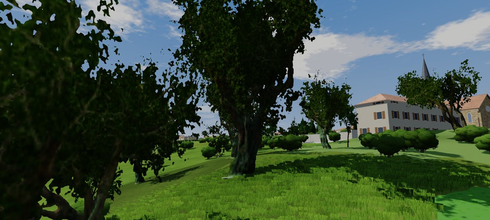

### Essences relevées sur Street View et mobilier du bourg

467 végétaux du bourg ont été identifiés un à un sur Street View (thuyas, lauriers et photinias, sapins, feuillus,
fruitiers, arbustes) ; les autres prennent l'essence de leurs voisins relevés. Les haies de la rue du Balcon sont en
thuyas ou en lauriers selon le relevé. Ajouts d'après OpenStreetMap et Street View : abribus bleu vitré de l'arrêt
« Rochetoirin - Église » et zigzags jaunes des arrêts de bus, croix de chemin en pierre, terrains de foot, city-stade,
tennis, boulodromes, aire de jeux, table de pique-nique, borne de recharge, poteau d'incendie, panneaux d'information.

### La logique prime sur la donnée brute

Les sources (OSM, orthophoto, cadastre) sont imprécises de quelques mètres : quand elles mènent à une scène absurde,
le générateur corrige vers le plausible (`docs/kb/21-coherence.md`). Rien sur la chaussée ni les trottoirs, clôtures et
haies d'un seul tenant par limite, routes jamais superposées (doublons supprimés, chaussées écartées), plus de taches
de sol (allées et cours aux formes nettes), piscines seulement dans les jardins. `tools/check_coherence.py` vérifie
tout automatiquement (de 1 836 violations à 4, toutes hors des rues du bourg).

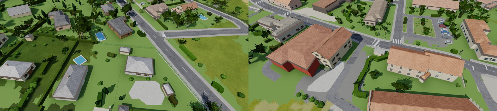

### Clôtures et portails de tout le bourg

Les limites cadastrales de tout le bourg (499 parcelles) portent clôtures, murets, haies et portails. Côté rue,
171 façades ont été relevées une à une sur Street View (`tools/clotures_bourg.json`) : haie de thuyas ou de lauriers,
muret enduit (crème, gris, rose) ou en pierre, grille sur muret avec piliers, panneaux rigides, panneaux occultants,
lisses blanches, palissade bois, portail en fer, bois, PVC blanc ou aluminium gris.

### Architecture des maisons d'après Street View

127 maisons du bourg ont été relevées une à une sur les vues Street View (`tools/archi_bourg.json`) : toit à deux pans
ou à croupes, nombre de niveaux, garage en sous-sol, portes de garage, escalier extérieur, auvent, balcon, cheminée,
combles, panneaux solaires, maisons anciennes, granges en pisé ou en pierre. `tools/archi.py` reconstruit chaque maison
en conséquence, éléments posés sur la façade côté rue (celle que voit la caméra Street View) ; la couleur des tuiles
est mesurée sur les photos.

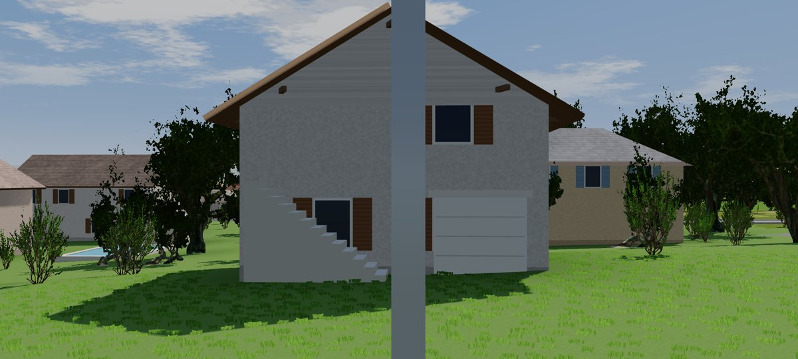

Depuis la v0.12, la façade sur rue de chacune de ces maisons est percée comme sur la photo (`tools/facades_ouvertures.json`,
relevé de gauche à droite et par niveau) : fenêtres à volets battants ouverts, volets roulants à moitié baissés, baies
vitrées, portes-fenêtres, porte d'entrée, portes de garage, portes de grange en planches, petites fenêtres, pignons
aveugles. Les ouvertures sont modélisées en relief (vitrage, dormant, appui, volets, coffres) ; les autres murs gardent
les fenêtres dessinées par le shader.

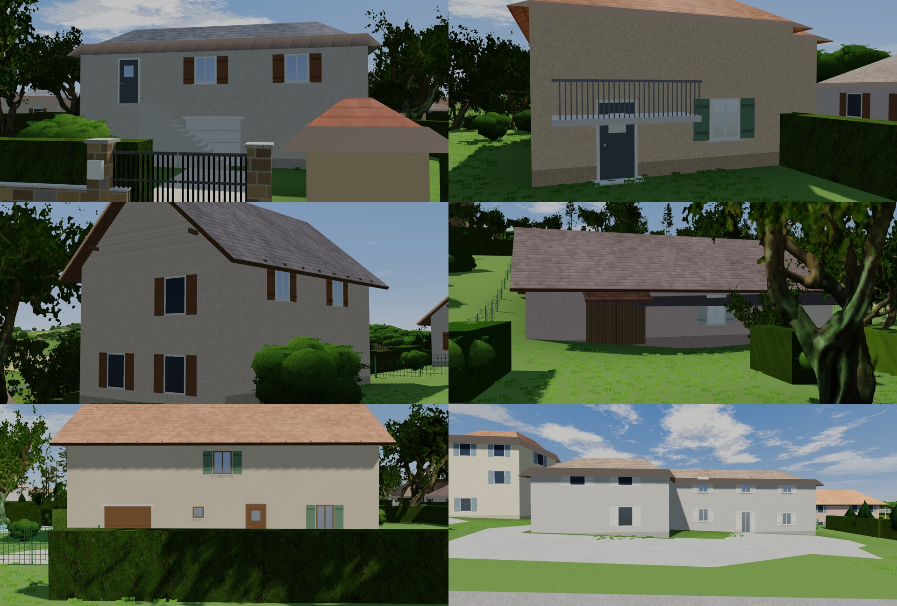

### Base de connaissance et agent

`docs/kb/` : fiches courtes (formats, pipeline, rendu, physique, pièges…) interrogées par `python3 tools/kb.py search "…"`
(BM25, sans dépendance) ; `.claude/agents/rochetoirin-dev.md` : agent de développement du projet qui s'appuie dessus.

### Trottoirs et carrefours (`tools/sidewalks.py`)

Les trottoirs sont construits en 2D puis maillés : une bande de 1,6 m par côté de rue, fusionnée avec les
autres, moins l'emprise exacte de l'enrobé (arrondie dans les angles de carrefour, rayon 3 m) et les bâtiments.
Ils se rejoignent sans trou aux carrefours, la bordure suit exactement le bord de la chaussée, et les angles
arrondis sont comblés d'enrobé. Îlots de rond-point et du parking de la rue de Ravette : bordure continue basse.

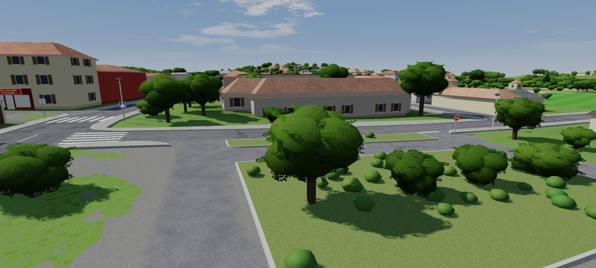

### Village de Rochetoirin d'après la photo aérienne IGN (BD ORTHO 20 cm)

`tools/prepare_village.py` analyse l'orthophotographie du bourg et de la rue du Balcon :
couleur réelle de chaque toit (tuile ou gris), ~9 000 arbres, arbustes et haies à leur vraie place
(houppiers détectés, conifères/feuillus, taille), ~60 piscines, cours et allées vs pelouses.

### Quartier de la rue du Balcon

`tools/prepare_quartier.py` croise le cadastre IGN (Parcellaire Express) et l'orthophoto :
haies taillées continues (thuyas sombres, lauriers) à leur position réelle, muret blanc et clôture à
lisses ou muret + grillage rigide côté rue (d'après Street View), grillage entre jardins, portails avec
piliers et boîte aux lettres aux entrées, gravier / béton / enrobé au sol (allées, parkings, terrasses),
Seuls les houppiers larges restent des arbres.
D'après la vidéo Street View de la rue (2014 / 2022) : muret enduit surmonté d'une haie de thuyas ou de lauriers
côté rue, clôtures PVC blanches, lisses bois, murets en pierre sèche à grille en fer forgé, portail plein blanc
du n° 12, caniveaux en béton clair, accotements en enrobé jusqu'aux portails, lampadaires à mât fin,
maisons rectangulaires à toit à deux pans débordant sur consoles, enduit crème et volets bois.

**v0.13 : la rue refaite d'après Street View** (`tools/rue_balcon.py`). 22 panoramas le long de la rue et de l'impasse
(4 directions chacun, `tools/fetch_sv_street.py`) ont été comparés image par image à des rendus du jeu pris aux mêmes
positions. Corrections :
- tracé : l'axe OpenStreetMap était 2 à 3 m trop au nord ; il suit maintenant la trace des caméras Street View (partie
  est) et la limite cadastrale (partie ouest, où les panoramas de 2014 sont eux-mêmes décalés) ;
- profil en travers réel : chaussée de 5 m, caniveau central en béton, trottoir à bordure côté sud, accotement en gravier
  puis en enrobé côté nord ;
- placette en enrobé au bout de la rue, avec sa petite impasse vers le nord, et chemin piéton vers l'impasse du Balcon ;
- clôtures relevées parcelle par parcelle : haies de thuyas ou de lauriers sur muret blanc, lisses en bois, haut mur
  gris et portail rouge, grillage sur piquets du potager, pré ouvert ; plus de tirage au hasard ;
- lampadaires aux emplacements relevés ; plus de piscine dans les jardins de devant.

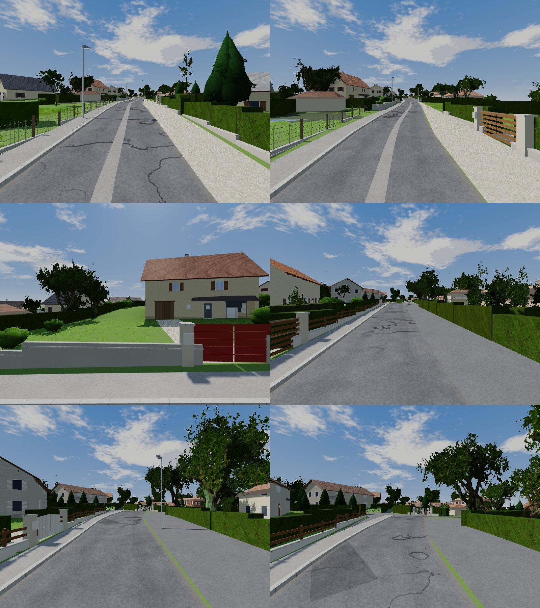

**v0.14 : propriétés redessinées une par une** (`tools/proprietes/`, `tools/proprietes.py`), d'après la photo aérienne IGN
(2021 et 2024, 10 cm) puis Street View : limites réelles (pas celles du cadastre, décalé de 1,5 à 3 m), murets en
escalier dans la pente, grillage à mailles losanges, haies, portail, allées, conifères denses à leur place et à leur
taille. Première maison : le n° 2, en cours de validation.

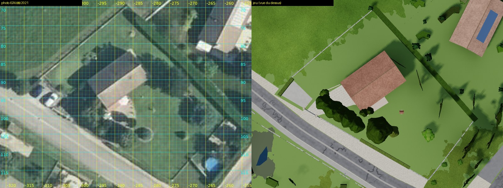

### Centre du village (d'après Google Street View, avril 2023)

Le cœur du village est modélisé à la main (`tools/center.py`) au lieu d'être généré :

| Élément | Détail |
|---|---|
| Église Saint-Étienne | moellons bruns et dorés, encadrements en pierre de taille, contreforts, baies en arc brisé, rose, transept, chevet polygonal, clocher latéral avec horloge et baies géminées, flèche octogonale en ardoise à lucarnes et clochetons |
| Place de l'église | gravier, platanes taillés en têtard, monument aux morts (obélisque), bornes, voitures garées le long de l'église |
| Mairie et médiathèque | crépi saumon / crème, encadrements blancs, chaînages d'angle, drapeaux, marquise, porte cintrée, oculus, enseignes, boîte aux lettres jaune, boîte à livres, muret et grille |
| Salle des fêtes | pignons à redents |
| Route du Village | boulangerie-pâtisserie (devanture bordeaux), restaurant « Le Rochetoirin » (façade rouge, stores, logo), local technique en béton |
| Parking de la rue de Ravette | enrobé, îlots plantés avec bordures, voitures garées, logements à volets bleu-gris |
| Cimetière | murs gris à chaperon, portail, ~200 tombes en granit, cyprès ; conteneurs de tri |

### Façades du village d'après Street View (API Google Street View Static)

`tools/fetch_streetview.py` récupère, pour chaque maison du bourg, la vue Street View la plus proche cadrée
sur la façade (198 vues) ; `tools/prepare_facades.py` projette l'emprise BD TOPO de la maison dans l'image
(position, cap, inclinaison et champ de la caméra connus) et mesure la couleur de l'enduit (médiane du mur
au-dessus des haies, sans ciel ni végétation) et la teinte dominante des volets (bois, blanc, gris, bleu,
vert, bordeaux). Les vues floues, masquées par la végétation ou en gros plan sont écartées : ~100 maisons
reprennent ainsi leur vraie couleur. Les images restent hors du dépôt ; la clé d'API se passe par la
variable d'environnement `GOOGLE_MAPS_API_KEY` et n'est jamais écrite dans les fichiers.

## Rendu graphique

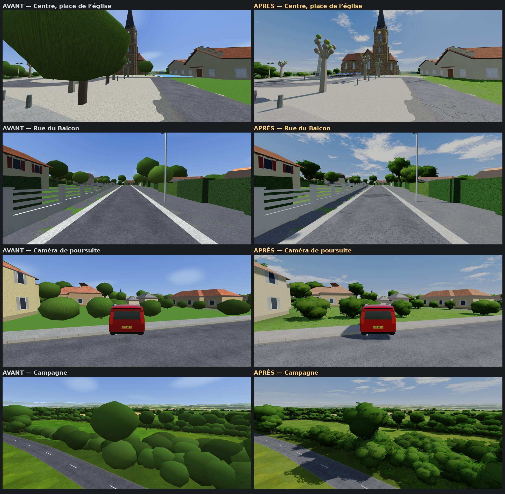


| Élément | Technique |
|---|---|
| Ombres portées du soleil | 2 cartes d'ombre en cascade (45 m nettes, 300 m), PCF matériel ; bâtiments, mobilier, haies, arbres (feuillage ajouré) et véhicule |
| Ciel | dégradé, halo de Mie, cumulus de beau temps générés par bruit (éclairés côté soleil, liseré argenté) |
| Étalonnage | courbe filmique ACES, perspective aérienne, brume de vallée |
| Arbres | houppiers en grappe de touffes + plaques de feuilles détourées, éclairage enveloppant, contre-jour |
| Herbe 3D | touffes instanciées sur 30 m autour de la caméra (prés, pâtures, jardins, épis de blé et d'orge), vent, masque routes / bâtiments |
| Occlusion ambiante | sol assombri au pied des murs et sous les houppiers (carte précalculée à 2 m) |
| Enrobé | granulats, rapiéçages, fissures, lustre au soleil rasant |

Option **Graphismes : élevés / standard** (menu Options) : en standard, ombres portées et herbe 3D
sont désactivées pour les téléphones modestes.

## Gameplay

* **Livraisons** façon ETS : carnet d'offres (marchandise, départ, arrivée, distance,
  rémunération), chargement sur place, GPS avec itinéraire calculé sur le vrai graphe
  routier, prime de ponctualité. L'argent est sauvegardé.
* **GPS** en haut à droite, zoom automatique selon la vitesse, carte complète en touchant le GPS.
* **Compteur**, rapport engagé (boîte auto 5 rapports), compte-tours, panneau de limitation
  (la vitesse passe en rouge en cas d'excès).
* **3 caméras** : poursuite, cabine (conduite à gauche, planche de bord centrale de l'Espace),
  poursuite éloignée. Glisser au centre de l'écran pour tourner la caméra / regarder autour.
* **Commandes** : boutons ◀ ▶ (braquage progressif tant qu'on appuie, retour au centre au relâché ;
  ou inclinaison du téléphone, dans les options), pédales d'accélérateur / frein analogiques
  (appuyer plus haut = plus fort), sélecteur D / R, klaxon (losange au-dessus des flèches).
* **Manette** (Bluetooth / USB, toute manette Android) : stick gauche ou croix = direction,
  RT = gaz, LT = frein (A / B sur les manettes sans gâchettes analogiques), Y = marche avant / arrière,
  LB = klaxon, RB ou Select = caméra, stick droit = regarder autour.
* **Son moteur synthétisé** (4 cylindres, admission, vent, roulement) et klaxon deux tons.
* **Physique** : couple d'un 2.0 16V ~140 ch, convertisseur, frein moteur, résistance de
  l'air, pente, adhérence moindre dans l'herbe et sur les chemins, sous-virage, tangage /
  roulis / pompage de la suspension.

## Le véhicule

Espace IV modélisé de façon procédurale (aucun fichier 3D) : pare-brise très incliné dans le
prolongement du capot, montants noirs donnant l'effet de vitrage continu, feux arrière
verticaux, barres de toit, rétroviseurs, jantes 5 branches, losange Renault, et les
**anciennes plaques FNI** : blanche à l'avant, **jaune à l'arrière**, numéro en **38**.

## Construire

Pré-requis : JDK 17+, Android SDK (platform 34, build-tools 34).

```bash
./gradlew assembleRelease   # APK : app/build/outputs/apk/release/app-release.apk
```

L'APK de release est signé avec la clé de debug pour pouvoir être installé directement
(`adb install` ou copie sur le téléphone). Android 7.0+ et OpenGL ES 3.0 requis.

## Régénérer les données

```bash
cd tools
pip install numpy scipy
./fetch_osm.sh             # routes, lieux, voie ferrée, mobilier OSM -> tools/data/osm*.json, pois.json
python3 fetch_elevation.py   # relief IGN -> tools/data/elev_*.npy
pip install shapely mapbox-earcut pillow
python3 fetch_decor.py       # BD TOPO + RPG (WFS Géoplateforme) -> tools/data/wfs_*.json
python3 fetch_ortho.py       # orthophoto IGN du village -> tools/data/ortho_village.jpg
python3 fetch_cadastre.py    # parcelles autour de la rue du Balcon -> tools/data/cadastre_balcon.json
GOOGLE_MAPS_API_KEY=... python3 fetch_streetview.py   # vues des façades -> tools/data/streetview/ (facultatif)
python3 prepare_facades.py   # couleurs enduit / volets -> tools/data/facades.json (facultatif)
python3 prepare_data.py      # -> app/src/main/assets/{terrain.bin, far.bin, roads.bin, map.json}
python3 prepare_decor.py     # -> landcover.png, landfar.png, props.bin, trees.bin, collide.bin, pano.bin
python3 prepare_street.py    # -> street.bin, decals.bin, surf.bin, street.json (+ collide.bin complété)
# center.py (centre du village) est appelé par prepare_decor.py et prepare_street.py ; il lit tools/data/center_osm.json
```

Requêtes Overpass utilisées (bbox `45.552,5.383,45.618,5.445`) :
`way["highway"]` (avec nœuds) pour les routes, et `place` / `amenity` / `shop` / `leisure`…
(`out center tags`) pour les lieux.

## Organisation du code

```
app/src/main/java/fr/rochetoirin/sim/
  MainActivity.kt        plein écran, chargement, capteurs, sauvegarde
  world/World.kt         terrain, routes, graphe, ponts, requêtes spatiales
  car/CarModel.kt        modèle 3D procédural de l'Espace
  car/Vehicle.kt         physique du véhicule
  game/Game.kt           boucle de jeu, livraisons, limitations, noms de rues
  game/Gps.kt            itinéraire A* sur le graphe OSM
  render/Renderer.kt     OpenGL ES 3 (tranches de profondeur, tuiles, caméras)
  render/Shaders.kt      terrain herbeux, routes avec marquages au sol, ciel, carrosserie
  ui/HudView.kt          interface tactile, GPS, compteur, menus
  ui/MapPainter.kt       carte vectorielle
  audio/EngineSound.kt   synthèse sonore temps réel
tools/                   préparation des données (Python)
```

Données : © contributeurs OpenStreetMap (ODbL) ; modèles 3D de végétation Poly Haven (CC0) ; « 2008 Renault Espace » par tonielpro520 (Sketchfab, CC-BY-4.0) ; IGN RGE ALTI, BD TOPO, BD ORTHO, Parcellaire Express et RPG (Licence Ouverte Etalab).

## Tests

```bash
./gradlew testDebugUnitTest
```

* `SimulationTest` : chargement du monde réel, accélération / freinage, accessibilité des
  lieux, et une **livraison complète par pilote automatique** (mairie → chargement →
  livraison → paiement) sur le vrai réseau routier.
* `collisionWithHouse` : on fonce dans une maison du village, le véhicule s'arrête et le choc est facturé.
* `HudSnapshotTest` (Robolectric) : rendu de l'interface dans `app/build/hud/*.png`.
