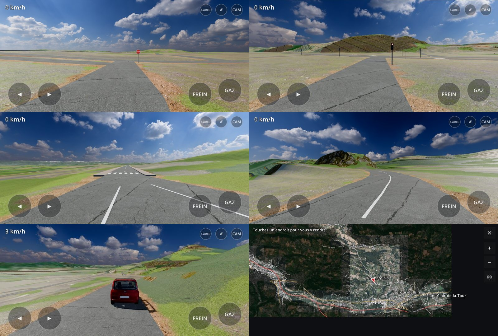

# Rochetoirin Simulator — branche `godot` (refonte)

Refonte complète sous **Godot 4** : relief IGN à 2 m, routes OpenStreetMap posées sur le relief réel, textures PBR,
ciel HDRI, horizon réel (Alpes, courbure terrestre). Zone : Rochetoirin, La Tour-du-Pin, Saint-Clair-de-la-Tour,
Saint-Chef, L'Isle-d'Abeau et les routes qui y mènent.

## Télécharger

**[RochetoirinSimulator-v2.1.apk — étape 2 : virages arrondis, panneaux, marquages, carte et téléportation](https://github.com/DisColow/rochetoirin-drive/raw/godot/releases/RochetoirinSimulator-v2.1.apk)**
(APK de 400 Mo, Android 8+, OpenGL ES 3). Étape précédente :
[v2.0](https://github.com/DisColow/rochetoirin-drive/raw/godot/releases/RochetoirinSimulator-v2.0.apk).



Nouveautés de l'étape 2 :
- virages arrondis (arcs tangents, rayon selon le type de route : 12 m en ville, 40 à 90 m sur les départementales,
  300 m sur l'autoroute), carrefours inchangés ;
- panneaux réels d'OpenStreetMap : STOP, cédez-le-passage, feux tricolores (animés, axes en opposition), entrées et
  sorties d'agglomération avec le nom de la commune, limitations de vitesse, arrêts de bus, voie verte ;
- marquages au sol : axe (tirets, ligne continue dans les courbes serrées et à l'approche des carrefours), rives,
  voies d'autoroute, lignes d'arrêt et de cédez-le-passage, passages piétons ;
- **carte** (bouton CARTE, touche M, bouton Select de la manette) : photo aérienne et routes, glisser pour déplacer,
  pincer pour zoomer, toucher un endroit pour s'y téléporter.


Commandes : ◀ ▶ pour tourner, GAZ, FREIN (rester appuyé à l'arrêt pour reculer), CAM (poursuite / conducteur / capot),
↺ remet la voiture sur la route. Manette : stick gauche, gâchettes, Y caméra, X remettre sur la route.

## Crédits

Relief et orthophotos : IGN (Licence Ouverte). Routes : © contributeurs OpenStreetMap (ODbL). Textures et ciel :
Poly Haven et ambientCG (CC0). Voiture : « 2008 Renault Espace » par tonielpro520 (Sketchfab, CC-BY-4.0).
Terrain : Terrain3D (MIT).

---

# Rochetoirin Simulator

Un jeu de conduite Android inspiré d'*Euro Truck Simulator*, dans le village de
**Rochetoirin (Isère, 38110)**, au volant d'un **Renault Espace IV rouge** (2002-2006).

## Télécharger

**[RochetoirinSimulator-v0.14.apk](https://github.com/DisColow/rochetoirin-drive/raw/main/releases/RochetoirinSimulator-v0.14.apk)** (36 Mo, Android 7.0+, OpenGL ES 3.0)

Ouvrir le lien depuis le téléphone, puis ouvrir le fichier et autoriser l'installation depuis
cette source (« Installer quand même » si Play Protect avertit : l'APK est signé avec une clé
de debug, il n'est pas publié sur le Play Store).

## Ce qui est fidèle à la réalité

| Élément | Source | Précision |
|---|---|---|
| Relief | IGN **RGE ALTI** (API altimétrie de la Géoplateforme) | grille de 10 m sur 4,6 × 6,2 km, 60 m pour l'horizon (17 km) |
| Routes | **OpenStreetMap** (Overpass) | tracé réel, largeur selon le type / nombre de voies, ponts, sens uniques |
| Limitations | OSM `maxspeed` sinon valeur par défaut française | 50 en agglomération, 80 hors agglo, 130 sur l'A43 |
| Noms de rues | OSM | affichés en haut de l'écran |
| Lieux de livraison | OSM (mairie, église Saint-Étienne, école, salle des fêtes, boulangerie, lieux-dits Pévrin, Vernavant, Falizan, L'Yris…) | |

Les chaussées séparées rapprochées (route de Lyon, D16, boulevards de La Tour-du-Pin…) sont
simplifiées en une seule route à double sens (sauf l'autoroute), et les raccords entre tronçons sont
mis à la même hauteur : plus de routes « coupées », ni de terre-plein ou de trottoir au milieu.

Le terrain est « terrassé » sous les routes (comme dans ETS) pour qu'elles soient
roulables, puis raccordé en douceur au relief réel.

### Décor (données réelles)

| Élément | Source |
|---|---|
| ~4 400 bâtiments : emprise, hauteur, matériaux des murs et du toit, usage | IGN **BD TOPO** |
| Toits à quatre pans en tuiles (typiques du Bas-Dauphiné), bac acier pour les hangars, toits plats | généré d'après la BD TOPO |
| Façades : enduits variés, fenêtres et volets (couleurs aléatoires), soubassement | shader procédural |
| Église Saint-Étienne avec clocher et flèche | BD TOPO (nature « Église ») |
| Cultures de chaque parcelle (blé, orge, maïs, tournesol, colza, prairies…), vues en début d'été | IGN **RPG 2025** |
| Bois, forêts de feuillus, peupleraies, haies (polygones et linéaires), landes | BD TOPO végétation + haies |
| ~150 000 arbres et arbustes (chênes, résineux, peupliers, fruitiers, buissons), arbres de jardin et arbres isolés du bocage | générés dans ces zones |
| Étangs (Fricotière, Gole…), Bourbre, ruisseaux et canaux, avec reflets animés | BD TOPO hydrographie |
| Pylônes et lignes 63 kV avec câbles | BD TOPO |
| Horizon : Chartreuse, Belledonne, Vercors, Bugey, avec neige en altitude, courbure terrestre et brume de vallée | IGN RGE ALTI (±75 km) |
| Anneau lointain : forêts, eau et villes réelles, mosaïque de parcelles | BD TOPO |

### Équipements de la route

| Élément | Source |
|---|---|
| Stops (32) et cédez-le-passage (33) avec ligne au sol et panneau, côté de la circulation concernée | OSM (`highway=stop/give_way`) |
| Passages piétons en zébra (113), panneau C20a sur les routes principales | OSM (`highway=crossing`) |
| Feux tricolores (11) avec ligne d'arrêt | OSM (`highway=traffic_signals`) |
| Plateaux ralentisseurs et dos d'âne (12), surélevés avec dents de requin, panneau A2b 25 m avant — ressentis dans la physique | OSM (`traffic_calming`) |
| Voie ferrée Lyon – Grenoble : ballast, traverses, rails, caténaires ; passages à niveau avec croix de Saint-André, feux, demi-barrières, rails noyés dans l'enrobé, panneau A7 | OSM (`railway`) |
| Panneaux d'entrée / sortie d'agglomération (Rochetoirin…), limitations de vitesse | OSM (`traffic_sign`) |
| Trottoirs (bordure basse de 10 cm franchissable, 1,6 m, continus et arrondis aux carrefours, angles comblés d'enrobé) | OSM `sidewalk` sinon déduits des zones bâties |
| ~1 500 lampadaires : « champignons » crème à vasque verte au centre du village, crosses modernes ailleurs | OSM + déduits (tous les 38 m en zone bâtie) |
| Terre-pleins : îlots engazonnés des ronds-points, glissières sur l'A43, bordures entre chaussées séparées | OSM (`junction=roundabout`, chaussées à sens unique opposées) |

Les bâtiments, arbres, haies, poteaux, îlots et glissières sont **solides** : un choc arrête le
véhicule et coûte une petite facture de carrosserie. Les trottoirs, îlots et ralentisseurs se montent (bordures basses, sans obstacle).

### La voiture : vrai modèle 3D d'Espace IV

Modèle « [2008 Renault Espace](https://sketchfab.com/3d-models/2008-renault-espace-b8e7c65711134fca865f635ccddafcf5) »
de [tonielpro520](https://sketchfab.com/tonielpro520), licence [CC-BY-4.0](http://creativecommons.org/licenses/by/4.0/) :
carrosserie repeinte en rouge, simplifié pour le mobile (`tools/import_car.py`), roues animées, volant animé,
plaques 4127 XR 38, habitacle visible depuis la caméra cabine.

### Végétation du bourg en modèles 3D (Poly Haven, CC0)

Les feuillus, arbustes et résineux du bourg (repérés sur l'orthophoto) sont des modèles 3D photoréalistes de
[Poly Haven](https://polyhaven.com) (licence CC0) : island_tree_01/02/03, tree_small_02, searsia_lucida, fir_tree_01.
Trop lourds pour un téléphone (0,3 à 17 millions de polygones), ils sont « photographiés » sous 8 angles
(`tools/arbres/`, three.js dans Chromium) en **imposteurs** : un panneau par arbre qui choisit et fond les deux vues
voisines, éclairé par le vrai soleil grâce aux normales et à la profondeur cuites, avec ombres portées.
Les haies taillées utilisent une texture de feuillage cuite à partir du même arbuste.


### Essences relevées sur Street View et mobilier du bourg

467 végétaux du bourg ont été identifiés un à un sur Street View (thuyas, lauriers et photinias, sapins, feuillus,
fruitiers, arbustes) ; les autres prennent l'essence de leurs voisins relevés. Les haies de la rue du Balcon sont en
thuyas ou en lauriers selon le relevé. Ajouts d'après OpenStreetMap et Street View : abribus bleu vitré de l'arrêt
« Rochetoirin - Église » et zigzags jaunes des arrêts de bus, croix de chemin en pierre, terrains de foot, city-stade,
tennis, boulodromes, aire de jeux, table de pique-nique, borne de recharge, poteau d'incendie, panneaux d'information.

### La logique prime sur la donnée brute

Les sources (OSM, orthophoto, cadastre) sont imprécises de quelques mètres : quand elles mènent à une scène absurde,
le générateur corrige vers le plausible (`docs/kb/21-coherence.md`). Rien sur la chaussée ni les trottoirs, clôtures et
haies d'un seul tenant par limite, routes jamais superposées (doublons supprimés, chaussées écartées), plus de taches
de sol (allées et cours aux formes nettes), piscines seulement dans les jardins. `tools/check_coherence.py` vérifie
tout automatiquement (de 1 836 violations à 4, toutes hors des rues du bourg).


### Clôtures et portails de tout le bourg

Les limites cadastrales de tout le bourg (499 parcelles) portent clôtures, murets, haies et portails. Côté rue,
171 façades ont été relevées une à une sur Street View (`tools/clotures_bourg.json`) : haie de thuyas ou de lauriers,
muret enduit (crème, gris, rose) ou en pierre, grille sur muret avec piliers, panneaux rigides, panneaux occultants,
lisses blanches, palissade bois, portail en fer, bois, PVC blanc ou aluminium gris.

### Architecture des maisons d'après Street View

127 maisons du bourg ont été relevées une à une sur les vues Street View (`tools/archi_bourg.json`) : toit à deux pans
ou à croupes, nombre de niveaux, garage en sous-sol, portes de garage, escalier extérieur, auvent, balcon, cheminée,
combles, panneaux solaires, maisons anciennes, granges en pisé ou en pierre. `tools/archi.py` reconstruit chaque maison
en conséquence, éléments posés sur la façade côté rue (celle que voit la caméra Street View) ; la couleur des tuiles
est mesurée sur les photos.


Depuis la v0.12, la façade sur rue de chacune de ces maisons est percée comme sur la photo (`tools/facades_ouvertures.json`,
relevé de gauche à droite et par niveau) : fenêtres à volets battants ouverts, volets roulants à moitié baissés, baies
vitrées, portes-fenêtres, porte d'entrée, portes de garage, portes de grange en planches, petites fenêtres, pignons
aveugles. Les ouvertures sont modélisées en relief (vitrage, dormant, appui, volets, coffres) ; les autres murs gardent
les fenêtres dessinées par le shader.


### Base de connaissance et agent

`docs/kb/` : fiches courtes (formats, pipeline, rendu, physique, pièges…) interrogées par `python3 tools/kb.py search "…"`
(BM25, sans dépendance) ; `.claude/agents/rochetoirin-dev.md` : agent de développement du projet qui s'appuie dessus.

### Trottoirs et carrefours (`tools/sidewalks.py`)

Les trottoirs sont construits en 2D puis maillés : une bande de 1,6 m par côté de rue, fusionnée avec les
autres, moins l'emprise exacte de l'enrobé (arrondie dans les angles de carrefour, rayon 3 m) et les bâtiments.
Ils se rejoignent sans trou aux carrefours, la bordure suit exactement le bord de la chaussée, et les angles
arrondis sont comblés d'enrobé. Îlots de rond-point et du parking de la rue de Ravette : bordure continue basse.


### Village de Rochetoirin d'après la photo aérienne IGN (BD ORTHO 20 cm)

`tools/prepare_village.py` analyse l'orthophotographie du bourg et de la rue du Balcon :
couleur réelle de chaque toit (tuile ou gris), ~9 000 arbres, arbustes et haies à leur vraie place
(houppiers détectés, conifères/feuillus, taille), ~60 piscines, cours et allées vs pelouses.

### Quartier de la rue du Balcon

`tools/prepare_quartier.py` croise le cadastre IGN (Parcellaire Express) et l'orthophoto :
haies taillées continues (thuyas sombres, lauriers) à leur position réelle, muret blanc et clôture à
lisses ou muret + grillage rigide côté rue (d'après Street View), grillage entre jardins, portails avec
piliers et boîte aux lettres aux entrées, gravier / béton / enrobé au sol (allées, parkings, terrasses),
Seuls les houppiers larges restent des arbres.
D'après la vidéo Street View de la rue (2014 / 2022) : muret enduit surmonté d'une haie de thuyas ou de lauriers
côté rue, clôtures PVC blanches, lisses bois, murets en pierre sèche à grille en fer forgé, portail plein blanc
du n° 12, caniveaux en béton clair, accotements en enrobé jusqu'aux portails, lampadaires à mât fin,
maisons rectangulaires à toit à deux pans débordant sur consoles, enduit crème et volets bois.

**v0.13 : la rue refaite d'après Street View** (`tools/rue_balcon.py`). 22 panoramas le long de la rue et de l'impasse
(4 directions chacun, `tools/fetch_sv_street.py`) ont été comparés image par image à des rendus du jeu pris aux mêmes
positions. Corrections :
- tracé : l'axe OpenStreetMap était 2 à 3 m trop au nord ; il suit maintenant la trace des caméras Street View (partie
  est) et la limite cadastrale (partie ouest, où les panoramas de 2014 sont eux-mêmes décalés) ;
- profil en travers réel : chaussée de 5 m, caniveau central en béton, trottoir à bordure côté sud, accotement en gravier
  puis en enrobé côté nord ;
- placette en enrobé au bout de la rue, avec sa petite impasse vers le nord, et chemin piéton vers l'impasse du Balcon ;
- clôtures relevées parcelle par parcelle : haies de thuyas ou de lauriers sur muret blanc, lisses en bois, haut mur
  gris et portail rouge, grillage sur piquets du potager, pré ouvert ; plus de tirage au hasard ;
- lampadaires aux emplacements relevés ; plus de piscine dans les jardins de devant.


**v0.14 : propriétés redessinées une par une** (`tools/proprietes/`, `tools/proprietes.py`), d'après la photo aérienne IGN
(2021 et 2024, 10 cm) puis Street View : limites réelles (pas celles du cadastre, décalé de 1,5 à 3 m), murets en
escalier dans la pente, grillage à mailles losanges, haies, portail, allées, conifères denses à leur place et à leur
taille. Première maison : le n° 2, en cours de validation.


### Centre du village (d'après Google Street View, avril 2023)

Le cœur du village est modélisé à la main (`tools/center.py`) au lieu d'être généré :

| Élément | Détail |
|---|---|
| Église Saint-Étienne | moellons bruns et dorés, encadrements en pierre de taille, contreforts, baies en arc brisé, rose, transept, chevet polygonal, clocher latéral avec horloge et baies géminées, flèche octogonale en ardoise à lucarnes et clochetons |
| Place de l'église | gravier, platanes taillés en têtard, monument aux morts (obélisque), bornes, voitures garées le long de l'église |
| Mairie et médiathèque | crépi saumon / crème, encadrements blancs, chaînages d'angle, drapeaux, marquise, porte cintrée, oculus, enseignes, boîte aux lettres jaune, boîte à livres, muret et grille |
| Salle des fêtes | pignons à redents |
| Route du Village | boulangerie-pâtisserie (devanture bordeaux), restaurant « Le Rochetoirin » (façade rouge, stores, logo), local technique en béton |
| Parking de la rue de Ravette | enrobé, îlots plantés avec bordures, voitures garées, logements à volets bleu-gris |
| Cimetière | murs gris à chaperon, portail, ~200 tombes en granit, cyprès ; conteneurs de tri |

### Façades du village d'après Street View (API Google Street View Static)

`tools/fetch_streetview.py` récupère, pour chaque maison du bourg, la vue Street View la plus proche cadrée
sur la façade (198 vues) ; `tools/prepare_facades.py` projette l'emprise BD TOPO de la maison dans l'image
(position, cap, inclinaison et champ de la caméra connus) et mesure la couleur de l'enduit (médiane du mur
au-dessus des haies, sans ciel ni végétation) et la teinte dominante des volets (bois, blanc, gris, bleu,
vert, bordeaux). Les vues floues, masquées par la végétation ou en gros plan sont écartées : ~100 maisons
reprennent ainsi leur vraie couleur. Les images restent hors du dépôt ; la clé d'API se passe par la
variable d'environnement `GOOGLE_MAPS_API_KEY` et n'est jamais écrite dans les fichiers.

## Rendu graphique


| Élément | Technique |
|---|---|
| Ombres portées du soleil | 2 cartes d'ombre en cascade (45 m nettes, 300 m), PCF matériel ; bâtiments, mobilier, haies, arbres (feuillage ajouré) et véhicule |
| Ciel | dégradé, halo de Mie, cumulus de beau temps générés par bruit (éclairés côté soleil, liseré argenté) |
| Étalonnage | courbe filmique ACES, perspective aérienne, brume de vallée |
| Arbres | houppiers en grappe de touffes + plaques de feuilles détourées, éclairage enveloppant, contre-jour |
| Herbe 3D | touffes instanciées sur 30 m autour de la caméra (prés, pâtures, jardins, épis de blé et d'orge), vent, masque routes / bâtiments |
| Occlusion ambiante | sol assombri au pied des murs et sous les houppiers (carte précalculée à 2 m) |
| Enrobé | granulats, rapiéçages, fissures, lustre au soleil rasant |

Option **Graphismes : élevés / standard** (menu Options) : en standard, ombres portées et herbe 3D
sont désactivées pour les téléphones modestes.

## Gameplay

* **Livraisons** façon ETS : carnet d'offres (marchandise, départ, arrivée, distance,
  rémunération), chargement sur place, GPS avec itinéraire calculé sur le vrai graphe
  routier, prime de ponctualité. L'argent est sauvegardé.
* **GPS** en haut à droite, zoom automatique selon la vitesse, carte complète en touchant le GPS.
* **Compteur**, rapport engagé (boîte auto 5 rapports), compte-tours, panneau de limitation
  (la vitesse passe en rouge en cas d'excès).
* **3 caméras** : poursuite, cabine (conduite à gauche, planche de bord centrale de l'Espace),
  poursuite éloignée. Glisser au centre de l'écran pour tourner la caméra / regarder autour.
* **Commandes** : boutons ◀ ▶ (braquage progressif tant qu'on appuie, retour au centre au relâché ;
  ou inclinaison du téléphone, dans les options), pédales d'accélérateur / frein analogiques
  (appuyer plus haut = plus fort), sélecteur D / R, klaxon (losange au-dessus des flèches).
* **Manette** (Bluetooth / USB, toute manette Android) : stick gauche ou croix = direction,
  RT = gaz, LT = frein (A / B sur les manettes sans gâchettes analogiques), Y = marche avant / arrière,
  LB = klaxon, RB ou Select = caméra, stick droit = regarder autour.
* **Son moteur synthétisé** (4 cylindres, admission, vent, roulement) et klaxon deux tons.
* **Physique** : couple d'un 2.0 16V ~140 ch, convertisseur, frein moteur, résistance de
  l'air, pente, adhérence moindre dans l'herbe et sur les chemins, sous-virage, tangage /
  roulis / pompage de la suspension.

## Le véhicule

Espace IV modélisé de façon procédurale (aucun fichier 3D) : pare-brise très incliné dans le
prolongement du capot, montants noirs donnant l'effet de vitrage continu, feux arrière
verticaux, barres de toit, rétroviseurs, jantes 5 branches, losange Renault, et les
**anciennes plaques FNI** : blanche à l'avant, **jaune à l'arrière**, numéro en **38**.

## Construire

Pré-requis : JDK 17+, Android SDK (platform 34, build-tools 34).

```bash
./gradlew assembleRelease   # APK : app/build/outputs/apk/release/app-release.apk
```

L'APK de release est signé avec la clé de debug pour pouvoir être installé directement
(`adb install` ou copie sur le téléphone). Android 7.0+ et OpenGL ES 3.0 requis.

## Régénérer les données

```bash
cd tools
pip install numpy scipy
./fetch_osm.sh             # routes, lieux, voie ferrée, mobilier OSM -> tools/data/osm*.json, pois.json
python3 fetch_elevation.py   # relief IGN -> tools/data/elev_*.npy
pip install shapely mapbox-earcut pillow
python3 fetch_decor.py       # BD TOPO + RPG (WFS Géoplateforme) -> tools/data/wfs_*.json
python3 fetch_ortho.py       # orthophoto IGN du village -> tools/data/ortho_village.jpg
python3 fetch_cadastre.py    # parcelles autour de la rue du Balcon -> tools/data/cadastre_balcon.json
GOOGLE_MAPS_API_KEY=... python3 fetch_streetview.py   # vues des façades -> tools/data/streetview/ (facultatif)
python3 prepare_facades.py   # couleurs enduit / volets -> tools/data/facades.json (facultatif)
python3 prepare_data.py      # -> app/src/main/assets/{terrain.bin, far.bin, roads.bin, map.json}
python3 prepare_decor.py     # -> landcover.png, landfar.png, props.bin, trees.bin, collide.bin, pano.bin
python3 prepare_street.py    # -> street.bin, decals.bin, surf.bin, street.json (+ collide.bin complété)
# center.py (centre du village) est appelé par prepare_decor.py et prepare_street.py ; il lit tools/data/center_osm.json
```

Requêtes Overpass utilisées (bbox `45.552,5.383,45.618,5.445`) :
`way["highway"]` (avec nœuds) pour les routes, et `place` / `amenity` / `shop` / `leisure`…
(`out center tags`) pour les lieux.

## Organisation du code

```
app/src/main/java/fr/rochetoirin/sim/
  MainActivity.kt        plein écran, chargement, capteurs, sauvegarde
  world/World.kt         terrain, routes, graphe, ponts, requêtes spatiales
  car/CarModel.kt        modèle 3D procédural de l'Espace
  car/Vehicle.kt         physique du véhicule
  game/Game.kt           boucle de jeu, livraisons, limitations, noms de rues
  game/Gps.kt            itinéraire A* sur le graphe OSM
  render/Renderer.kt     OpenGL ES 3 (tranches de profondeur, tuiles, caméras)
  render/Shaders.kt      terrain herbeux, routes avec marquages au sol, ciel, carrosserie
  ui/HudView.kt          interface tactile, GPS, compteur, menus
  ui/MapPainter.kt       carte vectorielle
  audio/EngineSound.kt   synthèse sonore temps réel
tools/                   préparation des données (Python)
```

Données : © contributeurs OpenStreetMap (ODbL) ; modèles 3D de végétation Poly Haven (CC0) ; « 2008 Renault Espace » par tonielpro520 (Sketchfab, CC-BY-4.0) ; IGN RGE ALTI, BD TOPO, BD ORTHO, Parcellaire Express et RPG (Licence Ouverte Etalab).

## Tests

```bash
./gradlew testDebugUnitTest
```

* `SimulationTest` : chargement du monde réel, accélération / freinage, accessibilité des
  lieux, et une **livraison complète par pilote automatique** (mairie → chargement →
  livraison → paiement) sur le vrai réseau routier.
* `collisionWithHouse` : on fonce dans une maison du village, le véhicule s'arrête et le choc est facturé.
* `HudSnapshotTest` (Robolectric) : rendu de l'interface dans `app/build/hud/*.png`.
